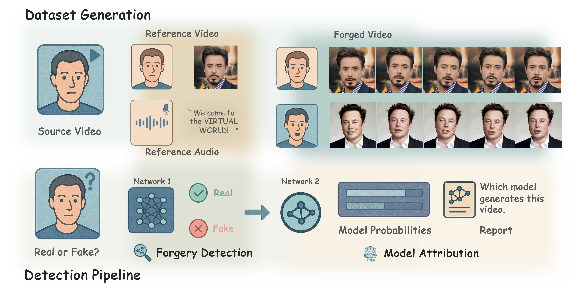
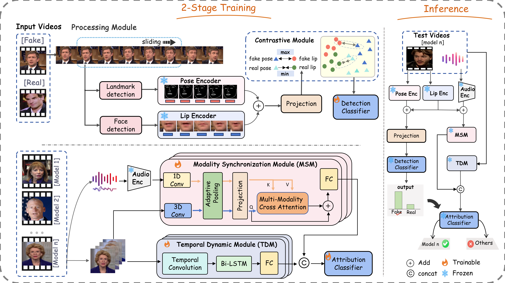

# Ariadne's Thread of LipSync: Unraveling Forgeries via Inconsistency between Lip Motions and Head Poses

## Overview

LipDA is a unified framework for joint LipSync forgery detection and source attribution. Unlike existing methods that target local visual artifacts or explicit audio–visual mismatches, LipDA exploits the intrinsic physiological coupling between lip motion and head pose — a global signal that current LipSync generation pipelines disrupt by design.

  

<em>LipSync-A construction and the detection–attribution pipeline.</em>

  

<em>LipDA two-stage training and inference.</em>

## Requirements

Python 3.8, CUDA 12.1, and `ffmpeg` on `PATH`.

~~~bash
pip install -r requirements.txt --extra-index-url https://download.pytorch.org/whl/cu121
~~~

## Dataset Preprocess

Download [LipSync-A](https://huggingface.co/datasets/AnsonShe/LipSync-A), [ModelScope](https://www.modelscope.cn/datasets/AnsonShe/LipSync-A), or [Google Drive](https://drive.google.com/drive/folders/1PrqA_n6OmUt8udB7pUFA65aDCWMkqcsj). Place clips as `real/<id>.mp4` and `fake/<generator>/<id>.mp4` (ids match `splits/*.json`).

~~~bash
export LIPDA_DATA_ROOT=/path/to/videos
export LIPDA_DLIB_CACHE=/path/to/dlib_t5_cache
~~~

Vision uses `$LIPDA_DLIB_CACHE/{split}_cache.npy`. Audio-visual detection and attribution use MediaPipe+MFCC caches from `extract_mesh.py` / `extract_audio.py`:

~~~bash
python preprocess/extract_mesh.py --split all
python preprocess/extract_audio.py --split all
~~~

Robustness (`video_distort.py`, `distort_split.py`, `make_audio_cache.py`):

~~~bash
python robust/distort_split.py --split test --type GB --level 3 --out_dir distorted/gb3
python preprocess/extract_mesh.py --list distorted/gb3/split.json --cache_dir cache_gb3
python preprocess/extract_audio.py --list distorted/gb3/split.json --cache_dir cache_gb3
~~~

~~~bash
python robust/make_audio_cache.py --split test --preset noise_light --out_cache cache_noise
~~~

## Validation

Vision paper Acc is **video-max @ 0.985** (Acc 0.9266 / AUC 0.9786). The same checkpoint also reports **video-mean @ 0.5** (Acc 0.9483 / AUC 0.9846), which is not the paper number. Audio-visual: Acc 0.9665 / AUC 0.9978; Acc 0.9783 / AUC 0.9991 with vision-max on silent clips. Attribution: Acc 0.9738 / macro-F1 0.9721.

~~~bash
python vision/infer.py --split test --save_scores logs/vision/test_scores.json
~~~

~~~bash
python audiovisual/infer.py --checkpoint weights/audiovisual_deepfake_detector.pth --vision_scores logs/vision/test_scores.json
~~~

~~~bash
python attribution/infer.py --checkpoint weights/generator_attribution.pth
~~~

~~~bash
python attribution/infer.py --json distorted/gb3/split.json --cache_dir cache_gb3
python audiovisual/infer.py --cache_dir cache_noise
~~~

## Train

`train.py` in `audiovisual/` and `attribution/`:

~~~bash
torchrun --nproc_per_node=8 audiovisual/train.py
~~~

~~~bash
torchrun --nproc_per_node=2 attribution/train.py --gpus 0,1
~~~

## Citation

~~~bibtex
@inproceedings{she2026ariadne,
  title     = {Ariadne's Thread of LipSync: Unraveling Forgeries via Inconsistency between Lip Motions and Head Poses},
  author    = {She, Tianyi and Liu, Jiawei and Liu, Weifeng and Zhao, Hanqing and Zhang, Weiming and Chen, Kejiang},
  booktitle = {Proceedings of the 43rd International Conference on Machine Learning},
  year      = {2026}
}
~~~
