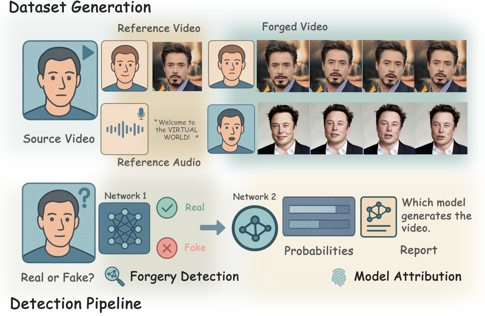

# Ariadne's Thread of LipSync

**Unraveling Forgeries via Inconsistency between Lip Motions and Head Poses**

Official repository for the ICML 2026 paper *Ariadne's Thread of LipSync: Unraveling Forgeries via Inconsistency between Lip Motions and Head Poses*.

[]()

<p align="center">
  
</p>

---

## Overview

LipDA is a unified framework for joint **LipSync forgery detection and source attribution**. Unlike existing methods that target local visual artifacts or explicit audio–visual mismatches, LipDA exploits the intrinsic physiological coupling between lip motion and head pose — a global signal that current LipSync generation pipelines disrupt by design.

---

## Release Status

> **We are actively organizing and open-sourcing this repository.**  
> **We expect to fully open-source all code and pretrained weights during the summer of 2026. Thank you for your patience for updates.**  

---

## Installation

```bash
git clone https://github.com/AnsonShe/LipDA.git
cd LipDA
pip install -r requirements.txt
```

- **ffmpeg** — required for audio extraction in Stage-2 and robustness modules.

---

## Data Layout

Organize raw LipSync videos as follows (used by `dataset.py`):

```
{dataset_root}/
├── 0_real/                  # real talking-head videos
│   └── *.mp4
└── 1_fake/                  # forged videos, grouped by generator
    ├── Wav2Lip/
    ├── SadTalker/
    └── ...
```

After preprocessing, the pipeline produces:

```
{out_root}/
├── train/  val/  test/      # per-video: frames/ + combos/combo_XXXXXX/
├── train_videos.json
├── val_videos.json
├── test_videos.json
├── train_combo_index.json
├── val_combo_index.json
└── test_combo_index.json
```

After combo sampling (`reduce_sample.py`):

```
reduced_data/
├── train_combo_index_reduced.json
└── val_combo_index_reduced.json
```

---

## Stage-1: Forgery Detection

Step 1 — Build video list

```bash
python dataset.py \
  --root_dir data/videos \
  --out_json lists.json
```

Step 2 — Preprocess (frames + combos + split)

```bash
python preprocess.py \
  --list_json lists.json \
  --out_root preprocessed_data \
  --train_ratio 0.7 \
  --val_ratio 0.15
```


Step 3 — Reduce training samples

```bash
python reduce_sample.py \
  --original_data_dir preprocessed_data \
  --reduced_data_dir reduced_data \
  --samples_per_video 4
```

Step 4 — Feature extraction (optional standalone test)


```bash
python extract_feature.py \
  --train_index reduced_data/train_combo_index_reduced.json \
  --val_index   reduced_data/val_combo_index_reduced.json
```

Step 5 — Train Stage-1 model

```bash
python train_stage1.py \
  --train_index reduced_data/train_combo_index_reduced.json \
  --val_index   reduced_data/val_combo_index_reduced.json \
  --save_dir    checkpoints \
  --epochs 20 \
  --batch_size 32 \
  --lr 1e-4 \
  --lstm_hidden 256
```

Step 6 — Inference / evaluation

```bash
python inference.py \
  --checkpoint checkpoints/best_model.pth \
  --test_videos_json preprocessed_data/test_videos.json \
  --preprocessed_dir preprocessed_data \
  --dlib_predictor shape_predictor_68_face_landmarks.dat \
  --num_combos_per_video 30 \
  --threshold 0.5 \
  --lstm_hidden 256 \
  --save_cache
```

---

## Stage-2: Generator Attribution


```bash
cd attribute_data

python train_stage2.py \
  --transformer_dir data/transformer \
  --gan_dir         data/GAN \
  --diffusion_dir   data/diffusion \
  --vae_dir         data/VAE \
  --cnn_dir         data/CNN \
  --batch_size 8 \
  --epochs 60
```

---


## TODO

We are actively organizing and open-sourcing this repository. We are incrementally uploading code and will complete the full release during summer 2026. Thank you for your patience for updates.  

- [ ] LipSync-A dataset and download instructions
- [ ] Pretrained checkpoints (all benchmarks)
- [ ] Complete evaluation protocols & result reproduction guide

---

## Citation

```bibtex
@inproceedings{she2026ariadne,
  title     = {Ariadne's Thread of LipSync: Unraveling Forgeries via Inconsistency between Lip Motions and Head Poses},
  author    = {She, Tianyi and Liu, Jiawei and Liu, Weifeng and Zhao, Hanqing and Zhang, Weiming and Chen, Kejiang},
  booktitle = {Proceedings of the 43rd International Conference on Machine Learning},
  year      = {2026}
}
```